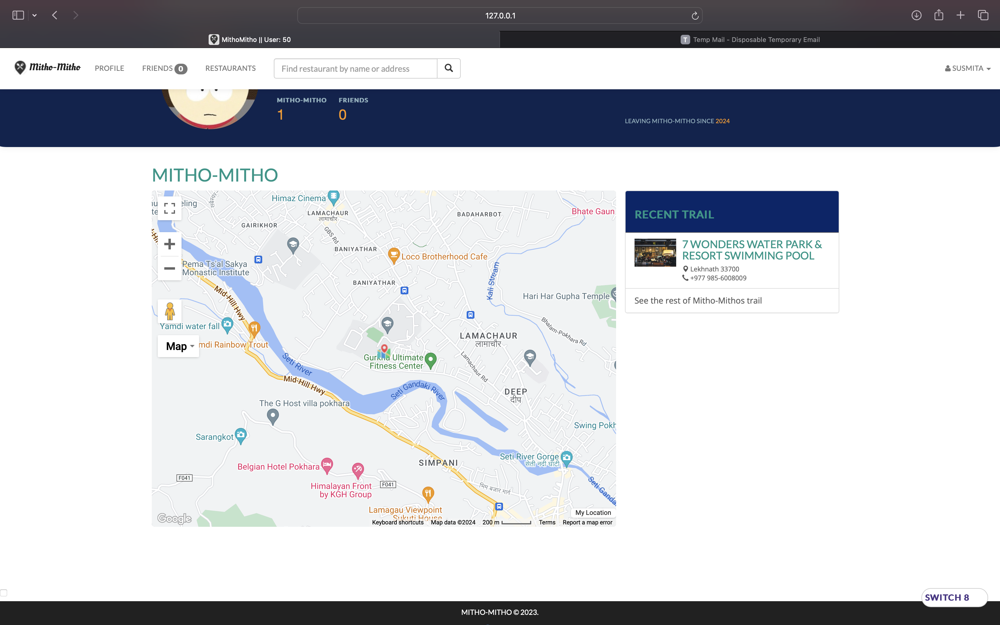

---

# MithoMitho - Your Ultimate Foodie Companion

Welcome to **Mitho-Mitho**, your ultimate foodie companion designed to enhance your culinary adventures in Pokhara Valley. Discover, track, and share your dining experiences with ease using our intuitive web application.

## 🍽️ Introduction

**Mitho-Mitho** is your personalized dining companion, meticulously crafted to cater to the needs of food enthusiasts in Pokhara Valley. From discovering new restaurants to tracking your dining history and connecting with friends, Mitho-Mitho offers a comprehensive platform to elevate your culinary experiences.

## 🔧 Technologies

**Front-end:** [HTML5](http://www.w3schools.com/html/), [CSS](http://www.w3schools.com/css/), [Bootstrap](http://getbootstrap.com), [JavaScript](https://developer.mozilla.org/en-US/docs/Web/JavaScript), [jQuery](https://jquery.com/), [AJAX](http://api.jquery.com/jquery.ajax/)

**Back-end:** [Python](https://www.python.org/), [Flask](http://flask.pocoo.org/), [Jinja2](http://jinja.pocoo.org/docs/dev/), [PostgreSQL](http://www.postgresql.org/), [SQLAlchemy](http://www.sqlalchemy.org/)

**Libraries and APIs:** 
- **Alembic==1.13.1**: Alembic is a lightweight database migration tool for usage with the SQLAlchemy Database Toolkit for Python.
- **Annotated-types==0.6.0**: A library for Python 3.7+ that defines classes for type-checked, annotated values with optional type inference.
- **Attrs==23.1.0**: Attrs is the Python package that will bring back the joy of writing classes by relieving you from the drudgery of implementing object protocols.
- **Bidict==0.22.1**: Bidict is a small, fast library for Python 3.6+ implementing a bidirectional mapping data structure.
- **Blinker==1.7.0**: Blinker provides a fast dispatching system that allows any number of interested parties to subscribe to events, or "signals".
- **Certifi==2023.11.17**: Certifi is a carefully curated collection of Root Certificates for validating the trustworthiness of SSL certificates while verifying the identity of TLS hosts.
- **Charset-normalizer==3.3.2**: Charset-normalizer is a Python library that normalizes various charsets for use in Python applications.
- **Click==8.1.7**: Click is a Python package for creating command-line interfaces with ease.
- **Contextlib2==21.6.0**: Contextlib2 is a backport of the standard library’s contextlib module to earlier Python versions.
- **Coverage==7.3.4**: Coverage is a tool for measuring code coverage of Python programs.
- **Decorator==5.1.1**: Decorator is a library for defining function and method decorators in Python.
- **Dnspython==2.4.2**: Dnspython is a DNS toolkit for Python.
- **Eventlet==0.34.2**: Eventlet is a concurrent networking library for Python that allows you to change how you run your code, not how you write it.
- **Flasgger==0.9.7.1**: Flasgger is a Flask extension that creates Swagger API documentation from Flask applications.
- **Flask==3.0.0**: Flask is a lightweight WSGI web application framework in Python.
- **Flask-CLI==0.4.0**: Flask-CLI is a Flask extension that adds support for writing Click commands in Flask applications.
- **Flask-DebugToolbar==0.14.1**: Flask-DebugToolbar is a toolbar for debugging Flask applications.
- **Flask-Login==0.6.3**: Flask-Login provides user session management for Flask.
- **Flask-Mail==0.9.1**: Flask-Mail is an extension for Flask that makes it easy to send emails.
- **Flask-Migrate==4.0.5**: Flask-Migrate is an extension that handles SQLAlchemy database migrations for Flask applications using Alembic.
- **Flask-openapi3==3.0.1**: Flask-openapi3 is a Flask extension that generates OpenAPI 3 documentation from Flask applications.
- **Flask-Script==2.0.6**: Flask-Script is a Flask extension that adds support for writing external scripts in Flask applications.
- **Flask-SocketIO==5.3.6**: Flask-SocketIO is a Flask extension that adds WebSocket support to your Flask applications.
- **Flask-SQLAlchemy==3.1.1**: Flask-SQLAlchemy is a Flask extension that adds SQLAlchemy support to your Flask application.
- **Flask-Uploads==0.2.1**: Flask-Uploads is a Flask extension that handles file uploads.
- **Flask-WTF==1.2.1**: Flask-WTF is a Flask extension that integrates Flask with WTForms.
- **Greenlet==3.0.3**: Greenlet is a lightweight library for micro-threads in Python.
- **Gunicorn==21.2.0**: Gunicorn is a Python WSGI HTTP Server for UNIX.
- **H11==0.14.0**: H11 is a pure-Python, bring-your-own-I/O implementation of the HTTP/1.1 protocol.
- **Httplib2==0.22.0**: Httplib2 is a comprehensive HTTP client library for Python.
- **Idna==3.6**: Idna is a Python package for Internationalized Domain Names in Applications (IDNA).
- **Itsdangerous==2.1.2**: Itsdangerous is a library for passing trusted data to untrusted environments and back.
- **Jinja2==3.1.2**: Jinja2 is a full-featured template engine for Python.
- **Jsonschema==4.20.0**: Jsonschema is an implementation of JSON Schema validation for Python.
- **Jsonschema-specifications==2023.12.1**: Jsonschema-specifications is a Python package that provides JSON Schema specifications.
- **Mako==1.3.0**: Mako is a template library written in Python.
- **MarkupSafe==2.1.3**: MarkupSafe is a library for Python that implements a unicode string that is also safe to render in HTML and XML.
- **Mistune==3.0.2**: Mistune is a fast yet powerful Python Markdown parser.
- **Oauth2==1.9.0.post1**: Oauth2 is a Python library for OAuth 2.0.
- **Outcome==1.3.0.post0**: Outcome is a Python library for capturing the outcome of computations.
- **Packaging==23.2**: Packaging is a Python library for building and distributing Python packages.
- **Pillow==10.1.0**: Pillow is a Python Imaging Library (PIL) fork.
- **Psycopg2==2.9.9**: Psycopg2 is a PostgreSQL database adapter for Python.
- **Psycopg2-binary==2.9.9**: Psycopg2-binary is a binary package for psycopg2.
- **Pydantic==2.5.3**: Pydantic is a data validation and settings management library for Python.
- **Pydantic-core==2.14.6**: Pydantic-core is the core module of the Pydantic library.
- **Pyparsing==3.1.1**: Pyparsing is a library for creating parsers in Python.
- **PySocks==1.7.1**: PySocks is a Python SOCKS client module.
- **Python-dotenv==1

.0.0**: Python-dotenv is a Python module that reads the key-value pairs from a .env file and adds them to your environment variables.
- **Python-engineio==4.8.1**: Python-engineio is a Python implementation of the Engine.IO realtime web library.
- **Python-socketio==5.10.0**: Python-socketio is a Python implementation of the Socket.IO realtime web library.
- **PyYAML==6.0.1**: PyYAML is a YAML parser and emitter for Python.
- **Raven==6.10.0**: Raven is a Python library for error tracking.
- **Referencing==0.32.0**: Referencing is a Python library for reference counting.
- **Requests==2.31.0**: Requests is a Python library for making HTTP requests.
- **Rpds-py==0.16.2**: Rpds-py is a Python library for working with role-based access control (RBAC) permissions.
- **Selenium==4.16.0**: Selenium is a portable framework for testing web applications.
- **Setuptools==69.0.2**: Setuptools is a collection of enhancements to the Python distutils.
- **Simple-websocket==1.0.0**: Simple-websocket is a Python package for creating simple WebSocket servers.
- **Six==1.16.0**: Six is a Python 2 and 3 compatibility library.
- **Sniffio==1.3.0**: Sniffio is a library for Python to handle asynchronous I/O with ease.
- **Sortedcontainers==2.4.0**: Sortedcontainers is a Python Sorted Collections Library.
- **SQLAlchemy==2.0.25**: SQLAlchemy is a SQL toolkit and Object-Relational Mapper (ORM) for Python.
- **SQLAlchemy-searchable==2.0.0**: SQLAlchemy-searchable is an extension for SQLAlchemy that adds full-text search capabilities to SQLAlchemy models.
- **SQLAlchemy-Utils==0.41.1**: SQLAlchemy-Utils is a collection of various utility functions and custom data types for SQLAlchemy.
- **Trio==0.23.2**: Trio is an asynchronous I/O library for Python.
- **Trio-websocket==0.11.1**: Trio-websocket is a WebSocket library for Trio.
- **Typing-extensions==4.9.0**: Typing-extensions is a backport of the standard library’s typing module to earlier Python versions.
- **Urllib3==2.1.0**: Urllib3 is a powerful HTTP client for Python.
- **Validators==0.22.0**: Validators is a Python library for data validation.
- **Werkzeug==3.0.1**: Werkzeug is a comprehensive WSGI web application library for Python.
- **Wsproto==1.2.0**: Wsproto is a pure-Python WebSocket protocol stack.
- **WTForms==3.1.1**: WTForms is a flexible forms validation and rendering library for Python.
- **Yelp==1.0.2**: Yelp is a Python package for interacting with the Yelp API.
- **Google Maps API**: Google Maps API is a set of APIs provided by Google that allow developers to integrate Google Maps into their applications.

---

Feel free to adjust the format or add any additional information as needed!

## 🌟 Features

### 🔒 Authentication

- User-friendly registration and login process with [email OTP verification](#authentication).
- [OTP resend](#authentication) functionality for user convenience.
- [Password reset](#authentication) option for enhanced security.

### 🍜 Restaurant Search

- Effortlessly search for restaurants by name or address.
- Access detailed information and reviews for each restaurant.

### 🗺️ Personalized Restaurant History

- Utilized real-time data scraped from various sources to provide users with accurate information on restaurants and hotels in Pokhara Valley.
- Add restaurants to your personal map to create a trail of your dining history, with interactive indications and details for each visit.
- Explore your past dining experiences with ease.

### 🤝 Social Connectivity

- Connect with friends to view their dining activities.
- Send and accept friend requests to expand your culinary network.

### 📱 Responsive Design

- Enjoy a seamless user experience across various devices, including smartphones and tablets.

## 🛠️ Installation

To run **Mitho-Mitho** on any OS, follow these simple steps:

1. Install [PostgreSQL](https://www.postgresql.org/download/) and ensure it's running.
2. Clone the repository: `$ git clone https://github.com/Aayush518/Mitho-Mitho.git`
3. Create a virtual environment and activate it.
   - For Windows: 
     ```
     $ python -m venv env
     $ env\Scripts\activate
     ```
   - For macOS/Linux:
     ```
     $ python3 -m venv env
     $ source env/bin/activate
     ```
4. Install dependencies: `$ pip install -r requirements.txt`
5. Create a PostgreSQL database named `breadcrumbs`.
6. Seed the database with restaurants: `$ python seed.py`
7. Start the server: `$ python server.py`
8. Access **Mitho-Mitho** at `localhost:5000` in your browser.

## 🧪 Testing & Coverage

**Mitho-Mitho** is rigorously tested to ensure reliability and performance. We utilize unit tests, integration tests, and Selenium tests to maintain high standards.

- Current test coverage: 82%
- To run tests: `$ coverage run --omit=env/* tests/tests.py`
- For coverage report: `$ coverage report -m`
- Selenium tests: `$ python tests/seltests.py`

## 🚀 Deployment

**Mitho-Mitho** can be deployed to a production environment with ease. Simply follow the deployment instructions provided in the repository.

## 🔮 Future Enhancements

### Features

- Implement a feed of friends' recent restaurant activity upon login.
- Allow users to upload food pictures and leave comments for each restaurant visit.
- Enhance social features such as accepting or rejecting friend requests and messaging.

### Other

- Expand test coverage to include additional functionalities.
- Further optimize UI/UX for enhanced user satisfaction.

## 📝 Author

**Mitho-Mitho** is developed and maintained by [Aayush Adhikari](https://github.com/Aayush518), Aastha Paudel, Anup Neupane and Susmita Aryal. Connect with us on [GitHub](https://github.com/Aayush518) for any inquiries or contributions.

---

Experience the joy of dining like never before with **Mitho-Mitho**. Discover, track, and share your culinary adventures effortlessly. Happy dining! 🍽️

# PROJECT SCREENSHOTS

| Image 1 | Image 2 | Image 3 | Image 4 |
|---------|---------|---------|---------|
|  |  |  |  |
| Image 5 | Image 6 | Image 7 | Image 8 |
|  |  |  |  |
| Image 9 | Image 10 | Image 11 | Image 12 |
|  |  |  |  |
| Image 13 | Image 14 | Image 15 | Image 16 |
|  |  |  |  |
| Image 17 | Image 18 | Image 19 | Image 20 |
|  |  |  |  |
| Image 21 | Image 22 | Image 23 | Image 24 |
|  |  |  |  |
| Image 25 | Image 26 | Image 27 | Image 28 |
|  |  |  |  |
| Image 29 | Image 30 | Image 31 | Image 32 |
|  |  |  |  |
| Image 33 | Image 34 | Image 35 | Image 36 |
|  |  |  |  |
| Image 37 | Image 38 | Image 39 | Image 40 |
|  |  |  |  |
| Image 41 | Image 42 | Image 43 | Image 44 |
|  |  |  |  |
| Image 45 | Image 46 | Image 47 | Image 48 |
|  |  |  |  |
| Image 49 | Image 50 | Image 51 | Image 52 |
|  |  |  |  |
| Image 53 | Image 54 | Image 55 | Image 56 |
|  |  |  |  |
| Image 57 | Image 58 | Image 59 | Image 60 |
|---------|---------|---------|---------|
|  |  |  |  |

| Image 61 |
|---------|
|  |